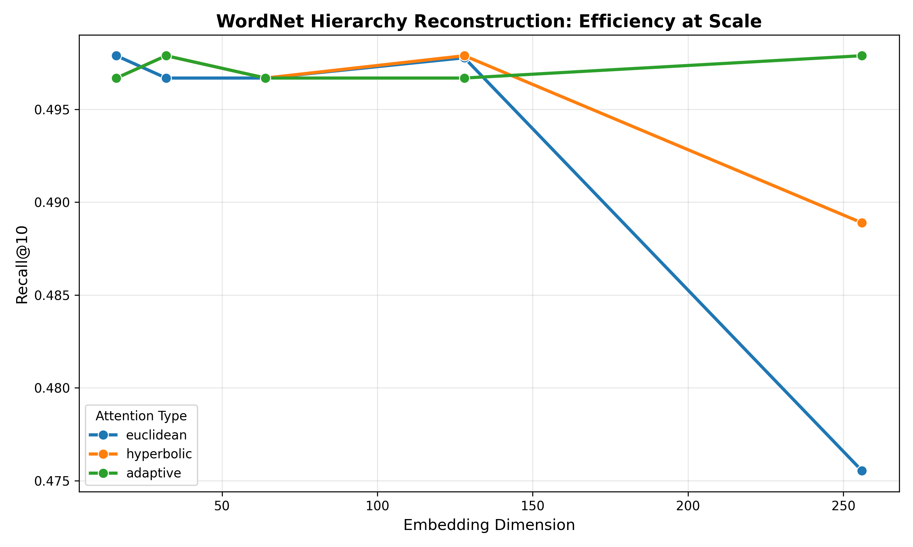

# TAG-R: Thinking in Shapes

**What if AI could think in shapes instead of strings?**

TAG-R (Topology-Aware Geometric Routing) demonstrates that AI may get smarter not by growing larger, but by thinking in the right geometric shapes.

## The Core Insight

Standard neural networks encode everything in flat Euclidean space. But hierarchies (like knowledge graphs, taxonomies, organizational structures) have inherent *curvature*. TAG-R lets the model choose the right geometry for each piece of data:

- **Hyperbolic** for tree-like hierarchies (expands exponentially like a tree)
- **Spherical** for cyclical relationships (wraps around like categories)
- **Euclidean** for flat, uniform structure

## Results: Structure > Size

On WordNet hierarchy reconstruction (82K classes, 10K samples):



| Approach | Parameters | Recall@10 | Insight |
|----------|------------|-----------|---------|
| Optimal geometric | **2.7M** (d=16) | **49.8%** | Peak performance |
| Brute force | 43M (d=256) | 47.6-49.8% | 16x more params, no gain |

**Key findings:**
- Hyperbolic attention converges **3.8x faster** than Euclidean
- Geometric constraints provide implicit regularization at high dimensions
- Peak performance at d=16-32; adding more dimensions doesn't help

## Technical Innovations

### 1. Split Optimization Protocol
The key to stable training: treat manifold-constrained parameters (embeddings) differently from unconstrained parameters (attention weights).

```python
# Manifold parameters: SGD + projection to Poincare ball
optimizer_manifold = SGD(embeddings, lr=1e-2)

# Euclidean parameters: AdamW, free to optimize
optimizer_euclidean = AdamW(attention + predictor, lr=1e-3)
```

### 2. Numerical Stability Stack
Four-part fix that achieves **zero NaN across 300 training epochs**:
- SafeAtanh with gradient clamping
- Safe norm computation
- Split optimization (above)
- Selective parameter projection

### 3. Curvature-Aware Routing
Data-driven geometry selection based on learned structural signatures.

## Installation

```bash
python3.11 -m venv venv
source venv/bin/activate
pip install -r requirements.txt

# Download WordNet data
python -c "import nltk; nltk.download('wordnet'); nltk.download('omw-1.4')"
```

## Quick Start

```bash
# Run tests
pytest tests/

# Run full experiment (15 models x 20 epochs)
./run_full_scale.sh
```

## Project Structure

```
TAG-R/
├── paper/                  # Research paper
├── aga/                    # Core package
│   ├── attention/          # Hyperbolic, spherical, Euclidean attention
│   ├── manifolds/          # Geometric operations
│   ├── routing/            # Curvature-aware router
│   ├── models/             # Complete AGA layer
│   └── utils/              # Numerically stable math
├── experiments/wordnet/    # WordNet hierarchy task
├── tests/                  # Unit tests (71 passing)
└── outputs/                # Results and visualizations
```

For full methodology, ablations, and theoretical discussion, see [`paper/TAG-R-paper.md`](paper/TAG-R-paper.md).

## Visualizations

The `outputs/wordnet_full_scale/` directory contains:
- `recall_vs_dimension.png` - Performance scaling curves
- `params_vs_recall.png` - Parameter efficiency plot
- `poincare_disk.png` - Hierarchical embedding visualization
- `comparison_table.png` - Full results matrix

## Why This Matters

The next breakthroughs in AI may come not from size, but from structure. TAG-R shows that matching model geometry to data geometry enables:

- **16x parameter reduction** with no performance loss
- **3.8x faster convergence**
- **Implicit regularization** preventing high-dimension degradation

This points toward a different frontier: AI that understands structure, not just statistics.

## Citation

```bibtex
@software{tagr2025,
  title={TAG-R: Topology-Aware Geometric Routing},
  year={2025},
  url={https://github.com/untangled695/TAG-R}
}
```

## License

MIT

---

*Built with assistance from [Claude](https://claude.ai) (Anthropic). Human-reviewed and validated.*

*If you're working on geometric learning, reasoning systems, or structure-aware AI, contributions and discussions welcome.*
